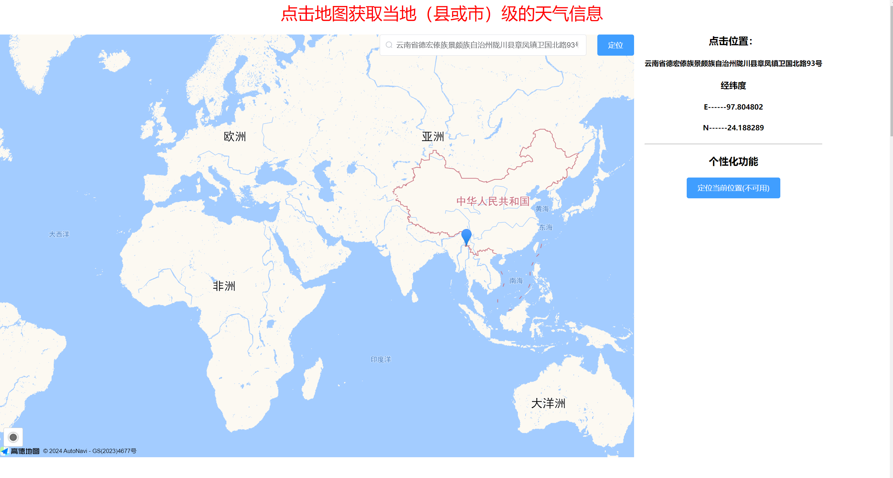
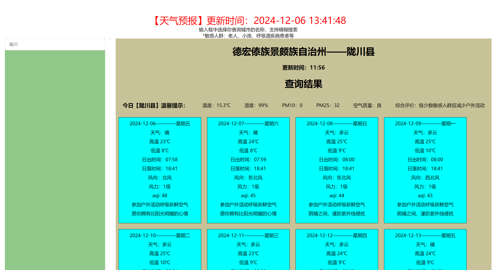
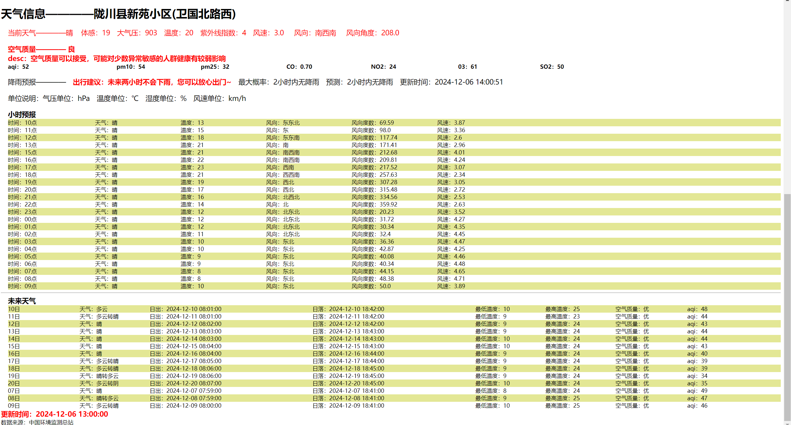
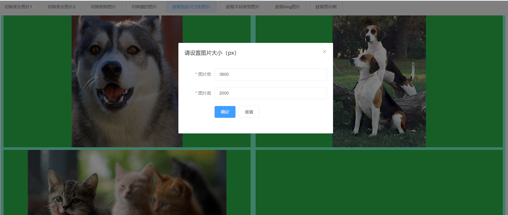
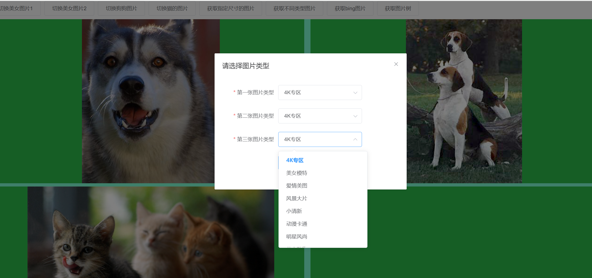
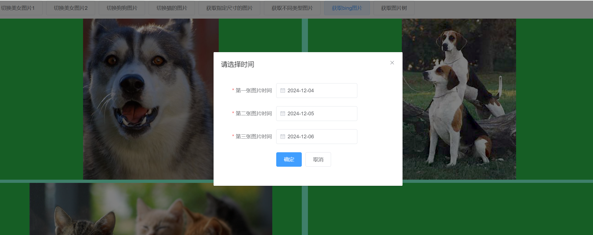
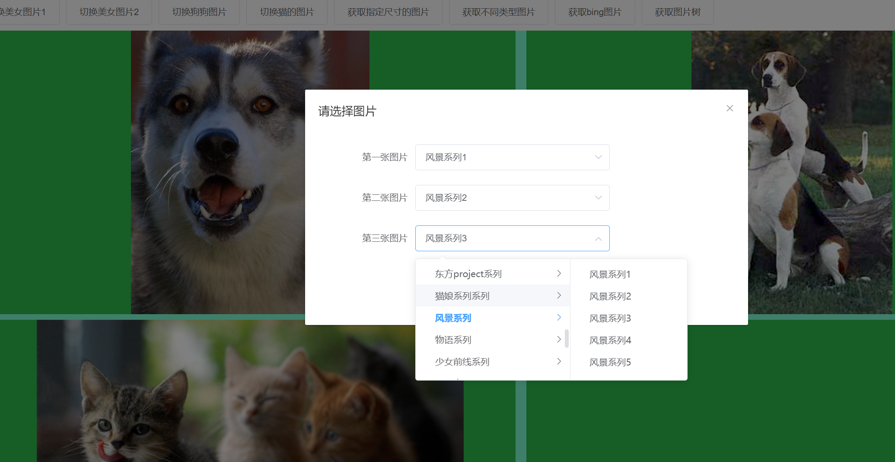
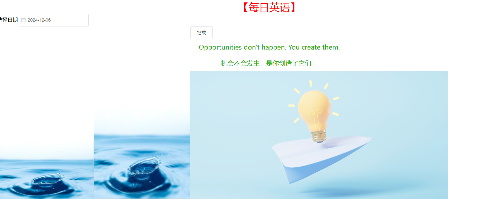
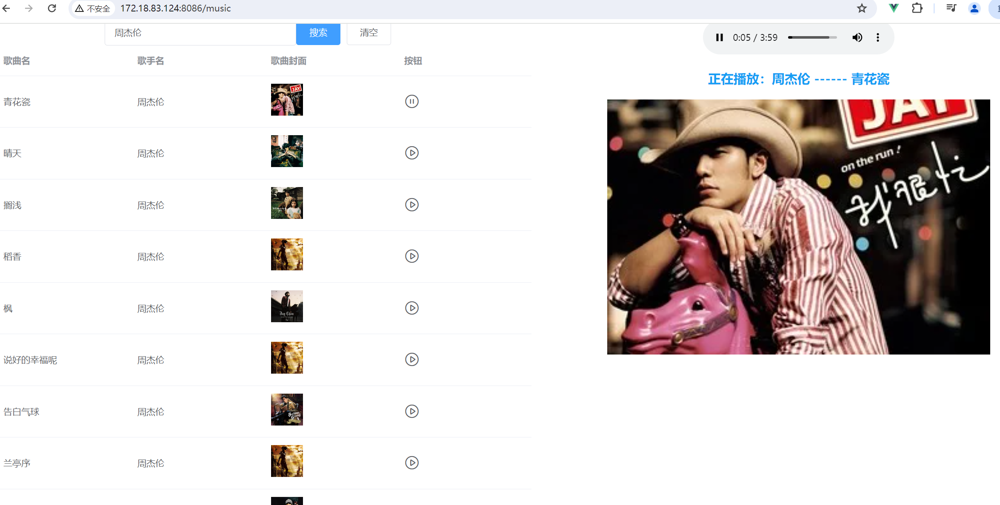

# pracitice

## Project setup
```
npm install
```

### Compiles and hot-reloads for development
```
npm run dev
```

### Compiles and minifies for production
```
npm run build
```

### Customize configuration
See [Configuration Reference](https://cli.vuejs.org/config/).

 **下面是关于项目的介绍** 

该项目原本是为了记录刚开始接触vue时候一些api的demo，后来发现网络上有很多好玩的接口，所以就在这些接口之上整合了一些功能。比如：

1、高德地图获取到县（县级市）名称查询天气预报的功能:


默认定位到的是我的家乡——云南省德宏州陇川县，同时，查询该位置的天气，也可以点击地图获取该区域的天气


2.高德地图点击后通过经纬度获取天气预报
地图用得都是一套组件，下面是查询结果展示：


3.访淘宝放大镜功能：这个功能从网上获取到了很多图片的api，有多重图片类型可供筛选，每次都能随机得到对应的图片，右下角区域是图片放大区域，双击图片可以单独放大展示，再次双击图片回到原来放大镜页面：

后面几个按钮还有单独的分类，比如：





4.每日英语，每天获取一句英文鸡汤，可以点击按钮播放，可以通过日期查询指定日期的每日英语


5.可以免费听歌，不用会员,支持歌曲名/歌手名模糊搜索，可以分页查询


6.通过QQ号查询基本用户信息（昵称，注册时间，等级，个性签名，头像）


还有其他功能，因主要是为了学习巩固，或者是技术提升，所以缺少了趣味性，所以暂时不在此特殊说明了。该项目也可以作为开发者学习vue2的一个项目骨架，添加个路由页面就可以开始写demo了。
温馨提示：小伙伴们在下载依赖和启动项目的时候，一定要注意node的版本号，推荐版本号：v14.21.3。版本太高下载依赖会报错，这时候请切换到这个版本试试。

推荐node下载地址：https://mirrors.tuna.tsinghua.edu.cn/    感谢 清华大学开源软件镜像站（推荐关注，还有很多比较全的插件以及对应的版本号）